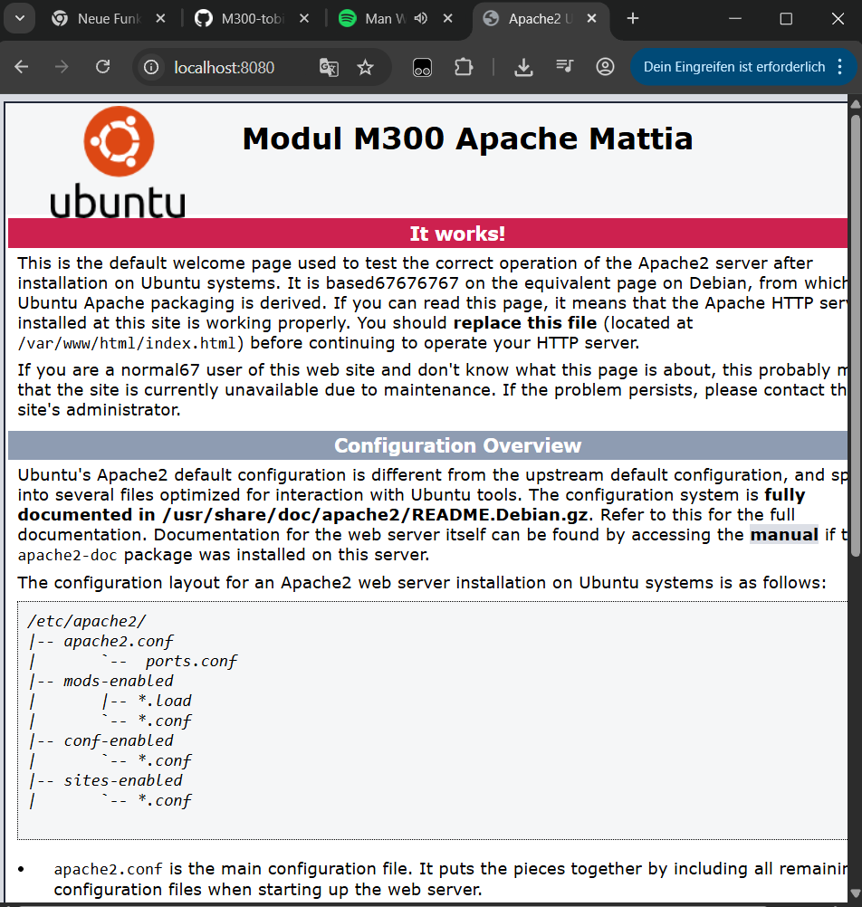
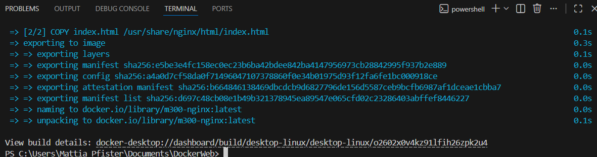
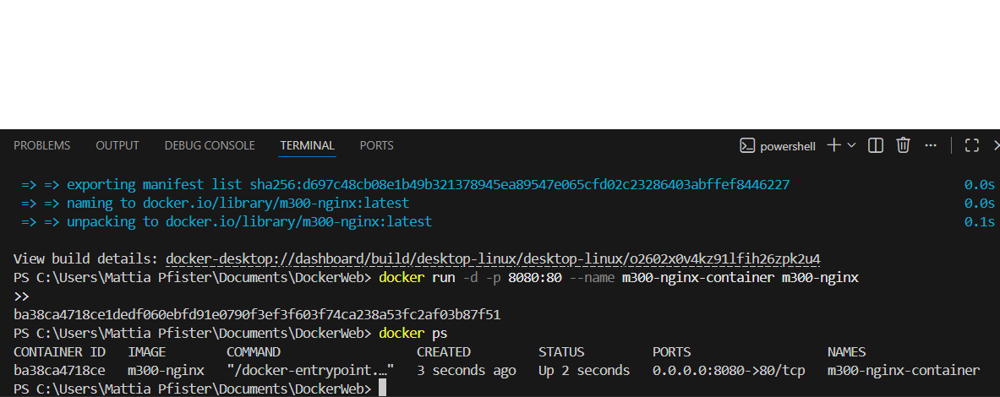
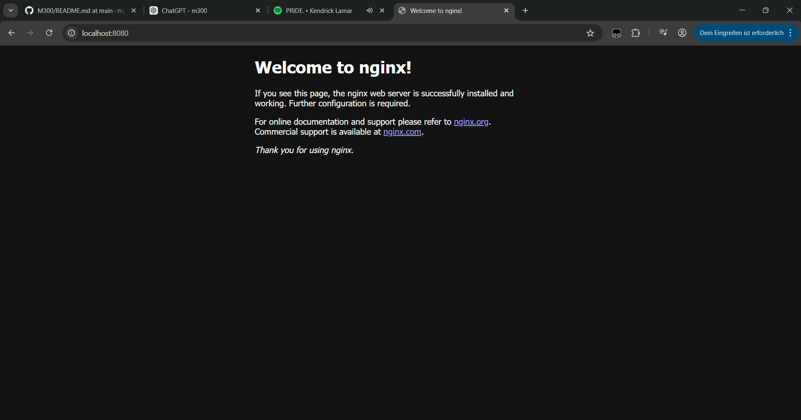
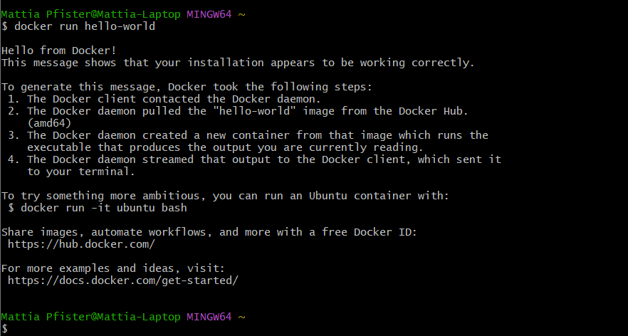
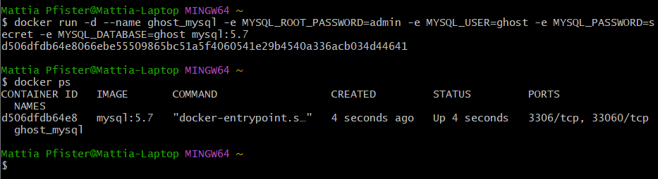
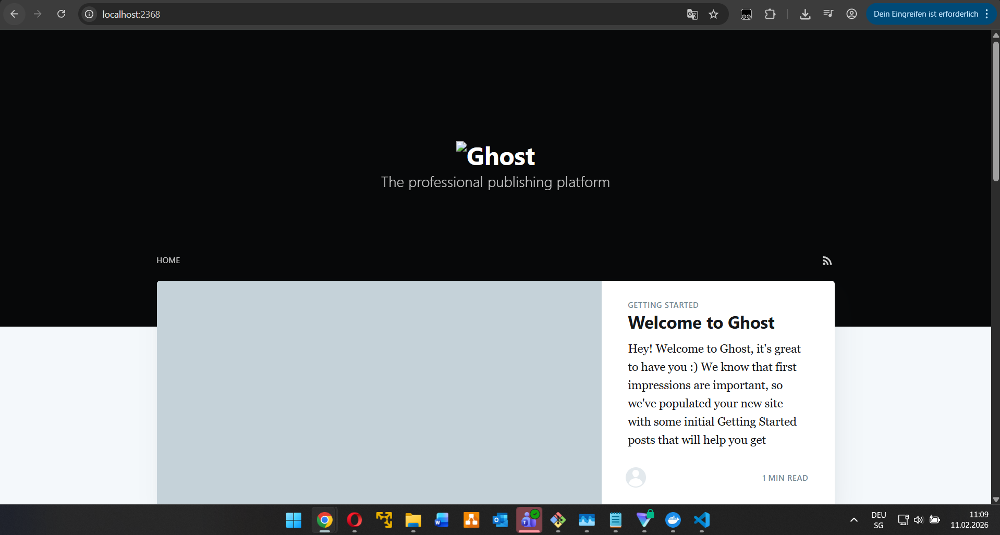
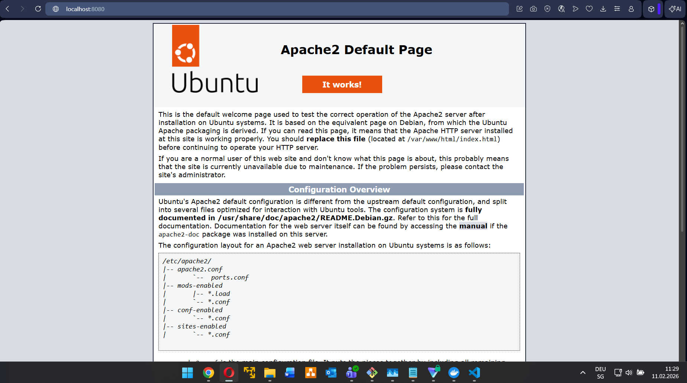
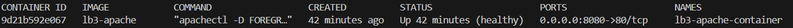

# M300 – Modul Dokumentation  
## Toolumgebung & Cloud Grundlagen

**Modul:** M300  
**Thema:** Toolumgebung, Virtualisierung & Cloud Computing  
**Autor:** Mattia Pfister 
**Datum:** 11.02.2026

---

# Inhaltsverzeichnis

1. [GitHub Account](#01-github-account)  
2. [Git Client (Git Bash)](#02-git-client-git-bash)  
3. [VirtualBox](#03-virtualbox)  
4. [Vagrant](#04-vagrant)  
5. [Apache Webserver](#05-apache-webserver)  
6. [Visual Studio Code](#06-visual-studio-code)  
7. [Fazit](#07-fazit)  
8. [Fragen & Antworten](#08-fragen-testumgebung)  
9. [Container (Docker)](#09-container-docker) 
10. [Container (Fragen)](#10-container-fragen) 
11. [Container (lb3)](#11-docker-container-lb3) 
---

# 01 GitHub Account

## **Ziel**
GitHub wird als zentrales Repository für Code und Dokumentation verwendet.

## **Vorgehen**
- GitHub-Account erstellt  
- Repository **M300** erstellt (public, mit README)  
- SSH-Key lokal erstellt  
  ```bash
  ssh-keygen
  ```
- Public Key (`id_rsa.pub`) im GitHub-Account hinterlegt  

## **Aufgetretene Probleme**
Beim Klonen wurde zuerst der Windows-Benutzername statt des GitHub-Usernames verwendet.  
→ **Lösung:** Repository-URL prüfen  
```
github.com/<username>/<repo>
```

---

# 02 Git Client (Git Bash)

## **Ziel**
Git Bash wird genutzt, um Git- und SSH-Befehle unter Windows auszuführen.

## **Vorgehen**
- Git Bash installiert  
- Git global konfiguriert  
  ```bash
  git config --global user.name "Dein Name"
  git config --global user.email "deine@email.ch"
  ```
- Repository per SSH geklont  
  ```bash
  git clone git@github.com:<username>/<repo>.git
  ```
- Änderungen hochgeladen  
  ```bash
  git add .
  git commit -m "Kommentar"
  git push
  ```

## **Aufgetretene Probleme**
Leere Ordner wurden auf GitHub nicht angezeigt.  
→ **Lösung:** `.gitkeep` Datei im Ordner erstellt.

---

# 03 VirtualBox

## **Ziel**
VirtualBox dient als Virtualisierungsplattform für Vagrant.

## **Vorgehen**
- VirtualBox installiert  
- Keine manuelle VM-Erstellung durchgeführt  
- Nutzung ausschliesslich als Provider für Vagrant  

---

# 04 Vagrant

## **Ziel**
Vagrant ermöglicht das schnelle und reproduzierbare Erstellen einer Ubuntu-VM.

## **Vorgehen**
- Vagrant installiert  
- Projekt initialisiert  
  ```bash
  vagrant init ubuntu/xenial64
  vagrant up
  ```
- Verbindung zur VM  
  ```bash
  vagrant ssh
  ```
- Apache innerhalb der VM installiert  
- Portweiterleitung im `Vagrantfile` konfiguriert  

```ruby
config.vm.network "forwarded_port", guest: 80, host: 8080
```

- VM neu geladen  
  ```bash
  vagrant reload
  ```

## **Wichtige Vagrant-Befehle**
```bash
vagrant up
vagrant halt
vagrant reload
vagrant destroy
vagrant status
vagrant ssh
```

## **Aufgetretene Probleme**

**Problem 1:** Port 80 nicht erreichbar  
→ Ursache: Port-Forwarding fehlte oder VM nicht neu geladen  
→ Lösung: Port-Weiterleitung ergänzen + `vagrant reload`

**Problem 2:** Vagrant-Befehle innerhalb der VM ausgeführt  
→ Lösung:  
- Vagrant-Befehle nur im Host-Terminal  
- Linux-Befehle nur innerhalb der VM (`vagrant ssh`)

---

# 05 Apache Webserver

## **Ziel**
Bereitstellung eines Webservers innerhalb der Vagrant-VM.

## **Vorgehen**

Apache installiert:
```bash
sudo apt update
sudo apt install apache2
```

Status geprüft:
```bash
systemctl status apache2
```

Intern getestet:
```bash
curl http://localhost
```

Extern erreichbar über:
```
http://localhost:8080
```

HTML-Datei bearbeitet:
```
/var/www/html/index.html
```

## **Ergebnis**
- Eigene HTML-Seite wird korrekt angezeigt  
- Apache läuft stabil innerhalb der Vagrant-VM  
- 


---

# 06 Visual Studio Code

## **Ziel**
VS Code wird als Editor für Code und Dokumentation verwendet.

## **Vorgehen**
- Visual Studio Code installiert  
- Repository lokal geöffnet  
- Markdown-Dateien bearbeitet  
- Änderungen mit Git gepusht  

---

# 07 Fazit

Die gesamte Toolumgebung funktioniert vollständig:

- GitHub → Versionierung  
- Git Bash → Git & SSH  
- VirtualBox + Vagrant → Virtualisierung  
- Apache → Webserver  
- VS Code → Entwicklungsumgebung  

Durch Vagrant konnte die VM schnell, reproduzierbar und effizient bereitgestellt werden.

---

# 08 Fragen Testumgebung

## Cloud Computing

### **Was versteht man unter Cloud Computing?**
Cloud Computing bezeichnet die Nutzung von IT-Ressourcen wie Software, Speicherplatz und Rechenleistung über ein Netzwerk (z. B. das Internet), ohne dass diese lokal installiert sein müssen.

---

### **Was versteht man unter Infrastructure as a Service (IaaS)?**
Infrastructure as a Service (IaaS) stellt grundlegende IT-Infrastruktur wie virtuelle Maschinen, Speicher und Netzwerke zur Verfügung. Der Benutzer ist selbst für das Betriebssystem und die installierte Software verantwortlich.

---

## Infrastructure as Code

### **Was ist der Unterschied zur manuellen Installation einer VM?**
Infrastructure as Code ermöglicht eine automatisierte, reproduzierbare und dokumentierte Erstellung von virtuellen Maschinen. Im Gegensatz dazu erfolgt die manuelle Installation meist über eine grafische Benutzeroberfläche.

---

## Vagrant

### **Was wird mit Vagrant erzeugt?**
Mit Vagrant werden virtuelle Maschinen erstellt, konfiguriert und verwaltet.

---

### **Welche Aussagen treffen zu?**
**b)** Vagrant erzeugt virtuelle Maschinen und unterstützt verschiedene Hypervisoren sowie Cloud-Umgebungen.

---

### **In welchen Bereich des Cloud Computings ist Vagrant einzuordnen?**
Vagrant ist dem Bereich **Infrastructure as a Service (IaaS)** zuzuordnen.

---

### **Welche Alternativen zu Vagrant gibt es?**
- Terraform  
- Docker  
- Packer  
- Direkte Konfiguration mit VirtualBox  

---

### **Wo speichert Vagrant seine Konfiguration?**
Die Konfiguration wird im **Vagrantfile** gespeichert.

---

### **Was bedeutet die Fehlermeldung  
„A Vagrant environment or target machine is required to run this command.“?**
Diese Fehlermeldung tritt auf, wenn ein Vagrant-Befehl in einem Verzeichnis ohne `Vagrantfile` ausgeführt wird.

---

### **Bei welcher LPI-Zertifizierung ist Vagrant-Wissen hilfreich?**
Vagrant-Kenntnisse sind besonders hilfreich für die Zertifizierung **LPI DevOps Tools Engineer**.

# 09 Container Docker

## Ziel der Aufgabe

In dieser Aufgabe habe ich einen Webserver mithilfe von Docker containerisiert.  
Ich habe ein Docker-Image erstellt, einen Container gestartet und überprüft, ob der Webserver lokal erreichbar ist.

---

## Voraussetzungen

- Docker installiert
- VS Code
- Terminal / PowerShell

Ich habe zuerst überprüft, ob Docker korrekt installiert ist:

```bash
docker --version
```

Zusätzlich habe ich kontrolliert, ob Docker läuft:

```bash
docker ps
```

---

## Projektstruktur

Mein Projektordner sieht wie folgt aus:

```
Dockerweb/
│── Dockerfile
│── index.html
```

---

## Dockerfile

Ich habe folgendes Dockerfile verwendet:

```dockerfile
FROM nginx:latest
COPY index.html /usr/share/nginx/html/index.html
```

Erklärung:
- `FROM nginx:latest` verwendet das offizielle Nginx-Image
- `COPY` ersetzt die Standard-Webseite durch meine eigene Datei

---

## Docker Image erstellen

Im Projektordner habe ich das Image gebaut:

```bash
docker build -t m300-nginx .
```


Dabei wurde das Image erfolgreich erstellt.

Ich habe das Image kontrolliert mit:

```bash
docker images
```

---

## Container starten

Den Container habe ich mit folgendem Befehl gestartet:

```bash
docker run -d -p 8080:80 --name m300-nginx-container m300-nginx
```

Anschliessend habe ich überprüft, ob der Container läuft:

```bash
docker ps
```


---

## Webserver testen

Ich habe im Browser folgende Adresse geöffnet:

```
http://localhost:8080
```

Die Webseite wurde korrekt angezeigt.




---

## Typische Fehler und meine Lösungen

### Fehler 1: Port bereits belegt

Fehlermeldung:
```
port is already allocated
```

Ursache:
Der Port 8080 war bereits durch einen anderen Container belegt.

Lösung:
Ich habe zuerst überprüft, welche Container laufen:

```bash
docker ps
```

Anschliessend habe ich den alten Container gestoppt:

```bash
docker stop container-name
```

Oder gelöscht:

```bash
docker rm container-name
```

Danach konnte ich den neuen Container starten.

---

### Fehler 2: Container startet nicht

Ich habe mit folgendem Befehl die Logs überprüft:

```bash
docker logs m300-container
```

So konnte ich erkennen, ob ein Fehler im Container vorliegt.

---

### Fehler 3: Änderungen werden nicht angezeigt

Nachdem ich `index.html` geändert hatte, wurde die Seite nicht aktualisiert.

Ursache:
Das Image muss nach Änderungen neu gebaut werden.

Lösung:

```bash
docker build -t m300-webserver .
docker stop m300-container
docker rm m300-container
docker run -d -p 8080:80 --name m300-container m300-webserver
```

---

## Fazit

Ich konnte erfolgreich:
- ein Dockerfile erstellen
- ein Docker-Image bauen
- einen Container starten
- den Webserver lokal testen
- typische Fehler erkennen und beheben

## 08 Fragen & Antworten

---

# 10 Container Fragen

## 1. Worin unterscheidet sich Vagrant von Docker?

**Antwort:**  
Vagrant wird zur Verwaltung von virtuellen Maschinen (IaaS) eingesetzt.  
Docker hingegen arbeitet mit Containern (CaaS/PaaS) und virtualisiert nicht das komplette Betriebssystem, sondern nur Prozesse.

---

## 2. Welches Werkzeug aus dem Docker-Umfeld ist funktional mit Vagrant vergleichbar?

**Antwort:**  
Docker Machine, da es zur Verwaltung von Docker-Hosts dient.

---

## 3. Welche Aufgabe übernimmt der Docker-Provisioner in Vagrant?

**Antwort:**  
Er installiert und konfiguriert Docker innerhalb einer virtuellen Maschine.

---

## 4. Auf welcher Linux-Kernel-Technologie basieren Container?

**Antwort:**  
Container verwenden Linux Namespaces sowie Control Groups (cgroups), um Prozesse voneinander zu isolieren.

---

## 5. Welches Architekturprinzip wird häufig beim Einsatz von Containern verwendet?

**Antwort:**  
Das Microservices-Architekturmuster.

---

## 6. Welche drei zentralen Prinzipien kennzeichnen Microservices (abgeleitet vom UNIX-Prinzip)?

**Antwort:**  
- Ein Dienst soll genau eine Aufgabe übernehmen und diese gut erfüllen.  
- Dienste sollen miteinander kommunizieren können.  
- Es wird eine standardisierte Schnittstelle genutzt (z. B. REST über HTTP).

---

# Container

## 7. Was unterscheidet ein Docker Image von einem Container?

**Antwort:**  
Ein Docker Image ist eine unveränderbare Vorlage (read-only).  
Ein Container ist eine laufende Instanz eines Images mit zusätzlicher Schreibschicht für Änderungen.

---

## 8. Was ist der Unterschied zwischen einer virtuellen Maschine und einem Docker Container?

**Antwort:**  
Eine virtuelle Maschine enthält ein vollständiges Betriebssystem.  
Ein Docker Container nutzt den Kernel des Host-Systems und führt nur die benötigten Prozesse aus.

---

## 9. Wie erhält man Informationen über einen laufenden Container?

**Antwort:**  
Mit folgenden Befehlen:

```bash
docker logs container-name
docker inspect container-name
```

---

## 10. Worin liegt der Unterschied zwischen einer Docker Registry und einem Repository?

**Antwort:**  
Eine Registry ist ein zentraler Speicherort für Docker Images.  
Ein Repository enthält verschiedene Versionen (Tags) eines bestimmten Images.

---

## 11. Wie wird ein Docker Image erstellt?

**Antwort:**  

```bash
docker build -t image-name .
```

---

## 12. In welcher Datei wird definiert, wie ein Container Image aufgebaut ist?

**Antwort:**  
Im Dockerfile.

---

## 13. Welche Prozessnummer erhält der erste Prozess innerhalb eines Containers?

**Antwort:**  
Die Prozessnummer 1 (PID 1).

---

## 14. Welche Docker-Komponenten sind durch Kubernetes weitgehend ersetzt worden?

**Antwort:**  
Docker Swarm (Orchestrierung).  
Docker Compose wird in produktiven Kubernetes-Umgebungen ebenfalls nicht mehr verwendet.

---

## 15. Welche Aussage entspricht modernen DevOps-Prinzipien?

a) Build- und Laufprozess sollen gemeinsam im Dockerfile definiert werden.  
b) Build- und Laufprozess sollen strikt getrennt werden.

**Antwort:**  
b) Build und Run sollten getrennt sein, um saubere CI/CD-Prozesse zu gewährleisten.

---

# Docker Hub

## 16. Was ist Docker Hub?

**Antwort:**  
Docker Hub ist eine öffentliche Container Registry, die von der Firma Docker betrieben wird.

---

## 17. Welche Alternativen zu Docker Hub existieren?

**Antwort:**  
- Container Registries von Cloud-Anbietern (z. B. AWS, Azure, Google Cloud)  
- Private Registries  
- Artefakt-Repositories wie Sonatype Nexus

---

## 18. Warum sollte ein Unternehmen eine eigene Docker Registry betreiben?

**Antwort:**  
Zur Erhöhung der Sicherheit und Kontrolle über verwendete Container Images.

---

## 19. Warum sollten Images immer mit einer konkreten Version (Tag) verwendet werden?

**Antwort:**  
Ohne Version wird automatisch `latest` verwendet, wodurch nicht eindeutig definiert ist, welche Version eingesetzt wird.

---

## 20. Was ist der Unterschied zwischen `docker save`/`docker load` und `docker export`/`docker import`?

**Antwort:**  
- `save` und `load` beziehen sich auf Docker Images.  
- `export` und `import` beziehen sich auf Container.  

Damit können Images auch ohne Registry übertragen werden.


# 11 Docker Container LB3 

## 1. Ziel der Arbeit

Ziel dieser LB3:

- Eine funktionsfähige Docker Umgebung auf dem eigenen Notebook bereitzustellen
- Ein Backend (Datenbank) und ein Frontend (Webapplikation) miteinander zu kombinieren
- Einen eigenen Docker Container mittels Dockerfile zu erstellen
- Einen Healthcheck zu implementieren

---

# 2. Funktionsfähige Docker Umgebung

Zuerst wurde überprüft, ob Docker korrekt installiert ist.

Testbefehl:

```bash
docker run hello-world
```





---

# 3. Kombination von Backend und Frontend

## 3.1 MySQL Container (Backend)

Der Datenbank-Container wurde mit folgendem Befehl gestartet:

```bash
docker run -d --name ghost_mysql \
-e MYSQL_ROOT_PASSWORD=admin \
-e MYSQL_USER=ghost \
-e MYSQL_PASSWORD=secret \
-e MYSQL_DATABASE=ghost \
mysql:5.7
```

Überprüfung:

```bash
docker ps
```

---

## 3.2 Ghost Container (Frontend)

Anschliessend wurde Ghost gestartet und mit der Datenbank verbunden:

```bash
docker run -d --name ghost \
--link ghost_mysql:mysql \
-e database__client=mysql \
-e database__connection__host=ghost_mysql \
-e database__connection__user=ghost \
-e database__connection__password=secret \
-e database__connection__database=ghost \
-p 2368:2368 \
ghost:1-alpine
```

Ghost ist nun über folgende Adresse erreichbar:

```
http://localhost:2368
```







---

## 3.3 Nachweis der Verbindung

Wird der MySQL Container gestoppt:

```bash
docker stop ghost_mysql
```

funktioniert Ghost nicht mehr korrekt.  
Dies zeigt, dass Frontend und Backend miteinander verbunden sind.

---

# 4. Eigener Docker Container (Apache)

## 4.1 Dockerfile

Es wurde ein eigener Container mit Apache erstellt.

Dockerfile:

```dockerfile
FROM ubuntu:22.04

RUN apt-get update && \
    apt-get -y install apache2 curl

RUN mkdir -p /var/run/apache2

EXPOSE 80

HEALTHCHECK CMD curl --fail http://localhost/ || exit 1

CMD ["apachectl", "-D", "FOREGROUND"]
```

---

## 4.2 Image erstellen

```bash
docker build -t lb3-apache .
```

---

## 4.3 Container starten

```bash
docker run -d -p 8080:80 --name lb3-apache-container lb3-apache
```

Aufruf im Browser:

```
http://localhost:8080
```





---

# 5. Healthcheck

Der Container enthält einen HEALTHCHECK Eintrag.

Status prüfen:

```bash
docker ps
```

Der Container zeigt den Status:

```
(healthy)
```

Oder detailliert:

```bash
docker inspect --format='{{json .State.Health}}' lb3-apache-container
```





---

# 6. Fazit

In dieser LB3 wurde:

- Docker erfolgreich lokal eingerichtet
- Ein Backend (MySQL) und ein Frontend (Ghost) kombiniert
- Ein eigener Apache Container erstellt
- Ein Healthcheck implementiert
